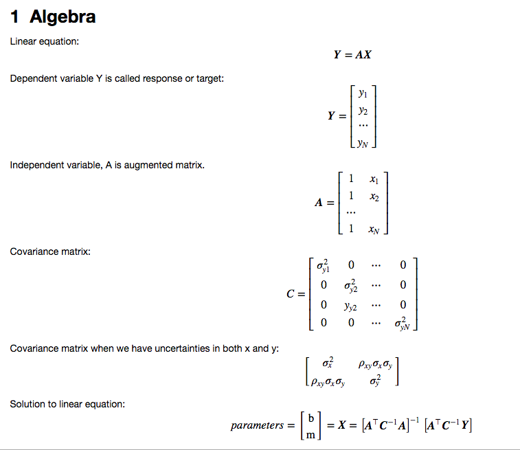
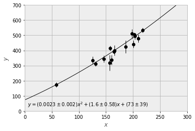
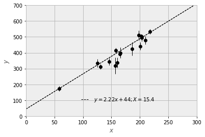

# Astro seminar 2019 Spring (Jan to May)

# Papers to discuss
- [Data analysis recipes: Fitting a model to data](https://arxiv.org/abs/1008.4686)
- [Dos and don’ts of reduced chi-squared](https://arxiv.org/abs/1012.3754)
- [Error estimation in astronomy: A guide](https://arxiv.org/abs/1009.2755)

# Data
```python
# index & x & y & sigm_y & sigma_x & corr 
1 & 201 & 592 & 61 & 9 & -0.84 # we use only x,y,sigm_y
2 & 244 & 401 & 25 & 4 & 0.31
3 & 47 & 583 & 38 & 11 & 0.64
4 & 287 & 402 & 15 & 7 & -0.27 # We exclude this row and above rows.
-----------------------------
5 & 203 & 495 & 21 & 5 & -0.33  # We take data from here
6 & 58 & 173 & 15 & 9 & 0.67
7 & 210 & 479 & 27 & 4 & -0.02
8 & 202 & 504 & 14 & 4 & -0.05
9 & 198 & 510 & 30 & 11 & -0.84
10 & 158 & 416 & 16 & 7 & -0.69
11 & 165 & 393 & 14 & 5 & 0.30
12 & 201 & 442 & 25 & 5 & -0.46
13 & 157 & 317 & 52 & 5 & -0.03
14 & 131 & 311 & 16 & 6 & 0.50
15 & 166 & 400 & 34 & 6 & 0.73
16 & 160 & 337 & 31 & 5 & -0.52
17 & 186 & 423 & 42 & 9 & 0.90
18 & 125 & 334 & 26 & 8 & 0.40
19 & 218 & 533 & 16 & 6 & -0.78
20 & 146 & 344 & 22 & 5 & -0.56
```

# Paper Data Analysis Recipes

```python
# Load a dataset with first 5 rows as outliers
import numpy as np
import pandas as pd
import matplotlib.pyplot as plt
plt.rcParams["figure.figsize"] = [10, 8]
%matplotlib inline

import scipy.linalg as linalg

# load data
df = pd.read_csv('data_allerr.dat',sep='&')
df.columns = [i.strip('#').strip() for i in df.columns]
print(df.shape)
df.head(10)

# matrices A,C, Y, yerr
df1 = df.iloc[4:, :]
x = df1.x.values
y = df1.y.values
yerr = df1['sigm_y'].values  # sigma y is yerr

degree = 2
Y = y
A = np.vander(x, degree+1, increasing=True).astype(float)  # 1, x, x**2
C = np.diag(yerr*yerr)  # diagonal matrix of yerr**2

# Bestfit
cinv = linalg.inv(C)
cinv_y = cinv @ Y.T
at_cinv_y = A.T @ cinv_y

cinv_a = cinv @ A
at_cinv_a = A.T @ cinv_a

bestfitvar = linalg.inv(at_cinv_a)
bestfit = bestfitvar @ at_cinv_y  # bestfit = params = c,b,a for ax**2 + bx + c

# plot bestfit
xrange = [0, 300]
yrange = [0, 700]
nsamples = 1001
xs = np.linspace(xrange[0], xrange[1], nsamples)
ys = np.zeros(len(xs))
for i in range(len(bestfit)):
    ys += bestfit[i] * xs**i

# plot
plt.plot(xs, ys, 'k-')
plt.xlim(xrange)
plt.ylim(yrange)
plt.xlabel(r'$x$')
plt.ylabel(r'$y$')

plt.errorbar(x, y, yerr, marker='o',color='k', linestyle='None')

# print text
# reverse the bestfit and bestfitvar
params = bestfit.tolist()[::-1]
err = np.sqrt(np.diag(bestfitvar)).tolist()[::-1]

# alternative params and err
params_err = [None]*(len(params)+len(err))
params_err[::2] = params
params_err[1::2] = err

# format text
fmt = [ ('({:.2g} \pm {:.2g})x^' + str(i) +' + ') for i in reversed(range(len(params)))]
fmt = ''.join(fmt)
fmt = fmt.rstrip('x^0 + ').replace('x^1','x')
text = r'$y = ' + fmt.format(*params_err) + r'$'

# plot text
plt.text(5, 30, text)
plt.show()
```


# Chi-Squared Value

$$
\chi ^ { 2 } = \sum _ { i = 1 } ^ { N } \frac { \left[ y _ { i } - f \left( x _ { i } \right) \right] ^ { 2 } } { \sigma _ { y i } ^ { 2 } } \equiv [ Y - A X ] ^ { \top } C ^ { - 1 } [ Y - A X ]
$$

# Using MAP method
```python
# Load a dataset with first 5 rows as outliers
import numpy as np
import pandas as pd
import matplotlib.pyplot as plt
import scipy.optimize as spo
plt.rcParams["figure.figsize"] = [10, 8]
%matplotlib inline

import scipy.linalg as linalg

# load data
df = pd.read_csv('data_allerr.dat',sep='&')
df.columns = [i.strip('#').strip() for i in df.columns]


# matrices A,C, Y, yerr
df1 = df.iloc[4:, :]
x = df1.x.values
y = df1.y.values
yerr = df1['sigm_y'].values  # sigma y is yerr

degree = 1
X = x
Y = y
A = np.vander(x, degree+1, increasing=True).astype(float)  # 1, x, x**2
C = np.diag(yerr*yerr)  # diagonal matrix of yerr**2

degree = 1
Y = y
A = np.vander(x, degree+1, increasing=True).astype(float)  # 1, x, x**2
C = np.diag(yerr*yerr)  # diagonal matrix of yerr**2

# Bestfit
cinv = linalg.inv(C)
cinv_y = cinv @ Y.T
at_cinv_y = A.T @ cinv_y

cinv_a = cinv @ A
at_cinv_a = A.T @ cinv_a

bestfitvar = linalg.inv(at_cinv_a)
bestfit = bestfitvar @ at_cinv_y  # bestfit = params = c,b,a for ax**2 + bx + c
print('bestfitvar =\n', bestfitvar, '\n\nbestfit=', bestfit)

# Log of bi-exponential cost function
def logbiexp(mb,X,Y,yerr):
    b,m = mb
    abs_err = np.fabs(Y -m*X -b)
    return np.sum(abs_err/yerr)

# Optimize bi-exponential objective function using bestfit
bestfitbiexp = spo.optimize.fmin(logbiexp,bestfit,(X,Y,yerr),disp=False)
print('\nbestfitbiexp = ', bestfitbiexp)

# plot errorbar
plt.errorbar(X,Y,yerr,color='k',marker='o',linestyle='None')

# Plot the best fit line
nsamples = 1001
plt.xlim(0,300)
plt.ylim(0,700)
xs = np.linspace(plt.xlim()[0],plt.xlim()[1],nsamples)
b,m = bestfitbiexp
ys = m * xs + b
sgn_str = '-' if b < 0 else '+'
cost = logbiexp(bestfitbiexp,X,Y,yerr)
label = 'y = {:4.2f}x {} {:2.0f}; X = {:3.1f}'.format(m,sgn_str,np.abs(b),cost)
label = r'$' + label + r' $'
plt.plot(xs,ys,color='k',ls='--',label=label)

# legends and limits
l = plt.legend(loc=(.3,.1),numpoints=8)
l.draw_frame(False)
plt.xlabel(r'$x$')
plt.ylabel(r'$y$')
plt.plot(xs,ys,'k--')
plt.show()
```

